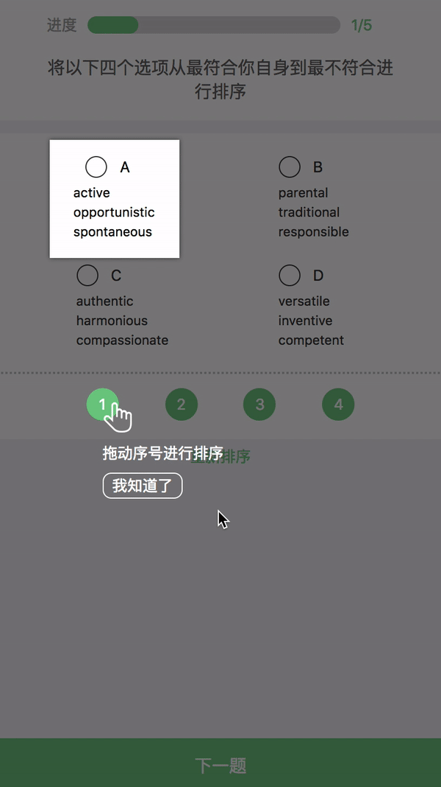

# 拖拽


# 问题
由于移动端存在负滚动, 影响拖拽效果
在拖拽页面禁止页面滚动
退出拖拽页面时再打开页面滚动

``` js
//禁止页面滚动
document.addEventListener('touchmove', function (e) {
  e.preventDefault();
}, { passive: false });
```

``` js
// 打开页面滚动
document.addEventListener(
  "touchmove",
  function(e) {
    e.returnValue = true;
  },
  { passive: false }
);
```